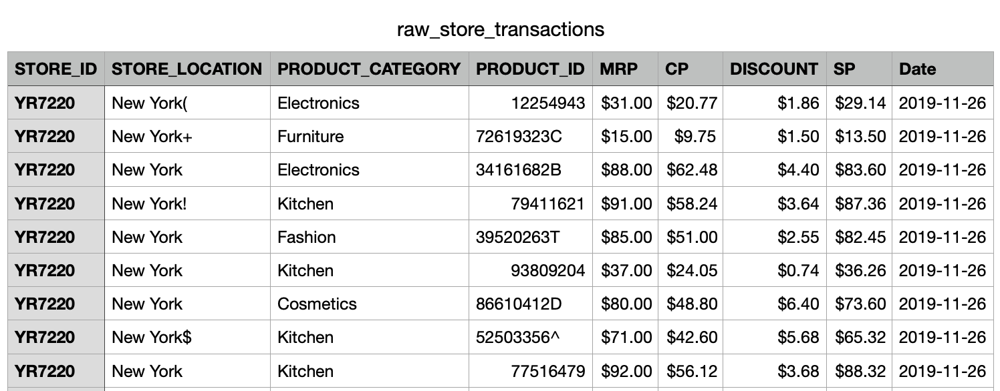
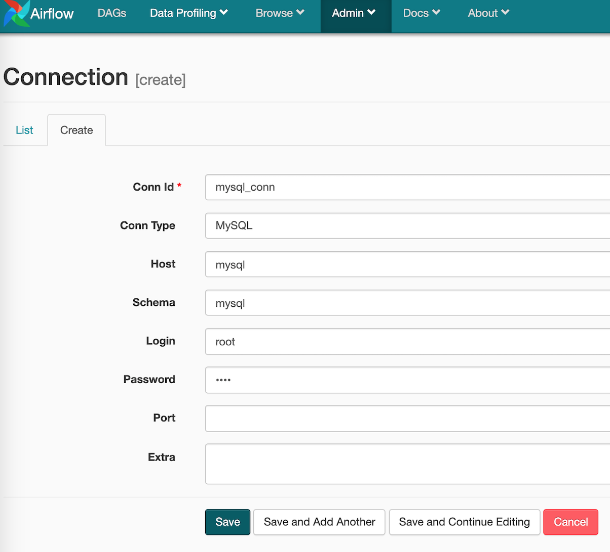

# airflow-store-sales-pipeline
## What It Does

Airflow pipeline for data reading, cleansing, aggregating, saving, and emailing the results! 



1. Read the raw_store_transactions.csv
2. Clean data 
   - Remove special charaters in the STORE_LOCATION column
   - Remove special characters in the PRODUCT_ID column
3. Create a MySQL table with proper schema for the cleaned store transaction data 
4. Insert the cleaned store transaction data to the created MySQL table 
5. Calculate store-wise and location-wise profit for yesterday and save the results in CSV files 
6. Rename the output files by adding target date 
7. Send an email with the two output files attached 
8. Rename the raw_store_transaction.csv file by adding yeserday date  


## Requirements

* Python 3.7+
* Docker


## Getting Started 

1. Download and install Docker if you haven't yet. [Docker Download](https://www.docker.com/products/docker-desktop)

2. Clone the repo and go to the root directory

3. Open `docker-compose-localExecutor.yml` and update `AIRFLOW__SMTP__SMTP_USER` and `AIRFLOW__SMTP__SMTP_PASSWORD` with the proper sender email 

4. Create a new image by run docker-compose file in terminal and installing necessary containers

   ```bash
   ➜ docker-compose -f ./docker-compose-localExecutor.yml up -d
   ```

5. Make sure proper containers are running 

   ```bash
   ➜ docker ps 
   ```

6. Open Airflow web server by visiting `https://localhost:8080` 

7. Create MySQL connection by going to Admin> Connections and typing the following information. You have to create connection whenever restarting the web server. 



8. To check the tables in MySQL, grab the mysql container id from `docker ps` and run `docker exec -it {container_id} bash`. `mysql -u root -p`, `use mysql`, and `show tables;`
9. Turn on the `store_dag` DAG and trigger the dag.
10. Get an email with processed dataset attached! 

